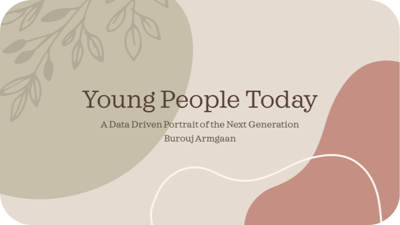

# Young People Today

 

[Link to the Kaggle dataset](https://www.kaggle.com/datasets/miroslavsabo/young-people-survey)

In 2013, students of the Statistics class at FSEV UK were asked to invite their friends to
participate in this survey.

- The data file, `data/responses.csv`, consists of 1010 rows and 150 columns (139 integer and 11 categorical).
- For convenience, the original variable names were shortened in the data file. See the `data/columns.csv` file if you want to match the data with the original names.
- The data contain missing values.
- The survey was presented to participants in both electronic and written form. The original questionnaire was in Slovak language and was later translated into English.
- All participants were of Slovakian nationality, aged between 15-30.

The variables can be split into the following groups:
- Music preferences (19 items)
- Movie preferences (12 items)
- Hobbies & interests (32 items)
- Phobias (10 items)
- Health habits (3 items)
- Personality traits, views on life, & opinions (57 items)
- Spending habits (7 items)
- Demographics (10 items)

# Presentation
Please refer to `YoungPeopleToday.pdf` for a detailed review of the study findings and key takeaways.

# Environment
```bash
conda create -n young_people python=3.11.5 ipykernel=6.25.0 ipywidgets=8.0.4 seaborn=0.12.2 scikit-learn=1.2.2 --yes
conda activate young_people
```

# Files and the research questions they answer
| File                           | Contents                                                                                                                           |
|--------------------------------|------------------------------------------------------------------------------------------------------------------------------------|
| `src/clustering.ipynb`         | Given the music preferences, do people make up any clusters of similar behavior?                                                   |
| `src/hypothesis_testing.ipynb` | Do women fear certain phenomena significantly more than men?                                                                       |
| `src/hypothesis_testing.ipynb` | Do left-handed people have different interests than right-handed?                                                                  |
| `src/childhood.ipynb`          | Analyze if there are differences between the participants based on where they lived most of their childhood: rural and urban area. |
| `src/missing_value.ipynb`      | Is there are trend between the questions students abstain from answering?                                                          |